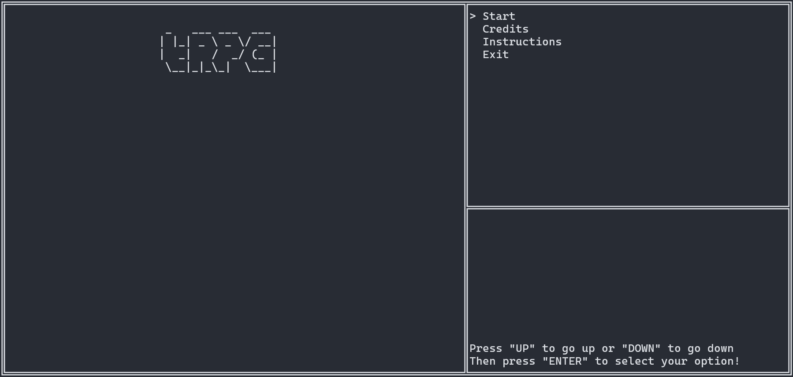
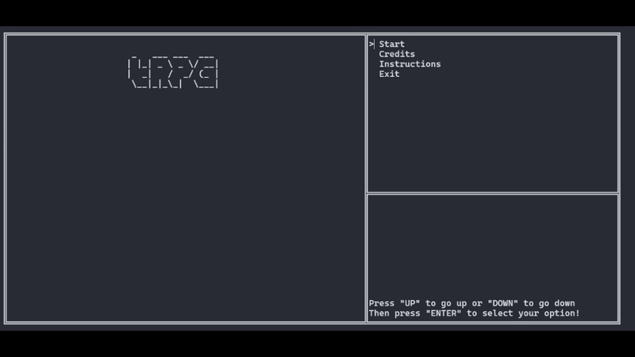

# tRPG (yes that stands for exactly what you think it does)
## Description
A "small" top-down RPG with a dialog box, entirely written in C, and fully playable in the terminal.

## How to run the program
- Download the source code
- Compile it with a C compiler in the Terminal
- `gcc AppMain.c Extra.c Game.c KeyboardInputs.c TitleScreenMessages.c Windows.c -o App`
- And execute `App.exe`

## FAQ
### *Will this work in Mac/Linux?*
Not sure, but it probably won't.

## :warning: WARNING
> THIS IS STILL IN THE WORKS. A LOT OF THINGS MIGHT CHANGE IN THE FUTURE.

## How it looks!

